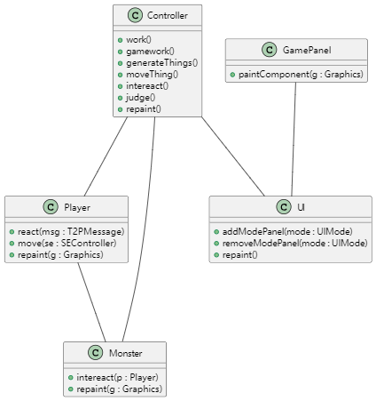
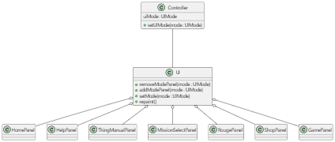

# 项目说明

这是一个基于java的游戏。玩家通过键盘按键可以移动角色，释放技能，消灭怪物等等。角色有血量、攻击力、防御力、等级、经验值、金币等等属性。为了更好的趣味性，我们打算设计许多种关卡。同时，我们还提供商店和“肉鸽”两种方式来提升角色的属性。具体操作都有图形界面引导，关于游戏玩法的更多说明，可以点击主界面中的“HELP”按钮。

## 启动游戏
使用 vscode 打开项目，运行src/com/App.java中的main方法即可。（注：如果报错，可能需要更改java版本，开发用的是jdk21）

## 项目结构
项目的主要包含了以下内容：
* package com 启动项目App.java，和主要的游戏控制逻辑Controller.java
* package com.data 包含了读取配置文件，保存游戏进度，读取保存游戏数据等操作
* package com.entity 包含了角色、怪物、奖励等内容
* package com.ui 包含了图形界面的主要控制逻辑
* package com.ui.panels 包含了游戏界面的各个面板

### 主要逻辑

如图所示

Controller 有一系列的函数，来让Player 和 Monster 来交互。Controller 通过 UI 来显示游戏界面。

### 界面切换逻辑

如图所示

UI 可以显示一系列的面板，可以通过调用Controller 中的setUIMode方法。UI能感知到这个变化，从而通过removeModePanel和addModePanel来切换面板。

## 游戏玩法的一些说明

          游戏时按键
A D：左右移动
w：跳跃
x：怪物手册，再次按x返回
f：技能
g：商店,再次按g返回
          机制说明
角色存在技能条（攻击属性旁），充满时会有音效提示
角色技能：对前方造成50（初始）倍攻击的伤害
       部分怪物技能解释
魔攻：攻击无视对方防御
坚固：防御至少为角色攻击-1
破甲：战前附带角色防御90%作为伤害
模仿：当角色属性更高时，属性等于角色属性
贯杀炮：第10回合造成攻击力1000%的伤害
怨念堆积：攻击+=仇恨值
怨念发酵：造成仇恨值的真伤，并使仇恨值翻倍，当被技能杀死后，仇恨值减半
残虐：当血量低于怪物血量时，伤害翻倍
净化：造成角色魔防两倍的伤害
